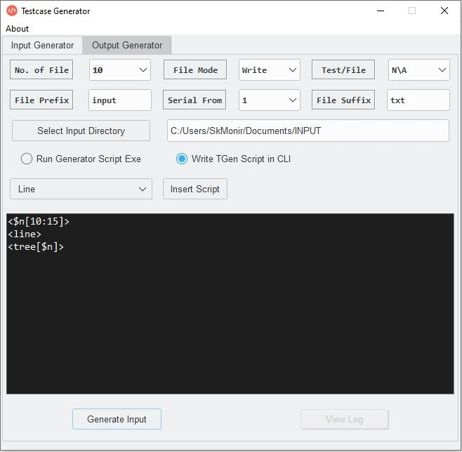
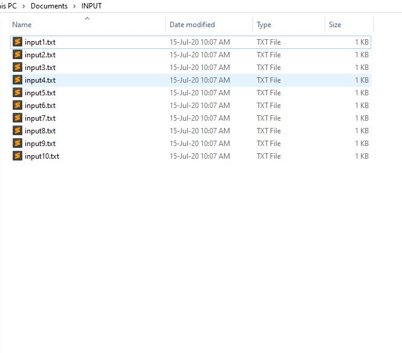
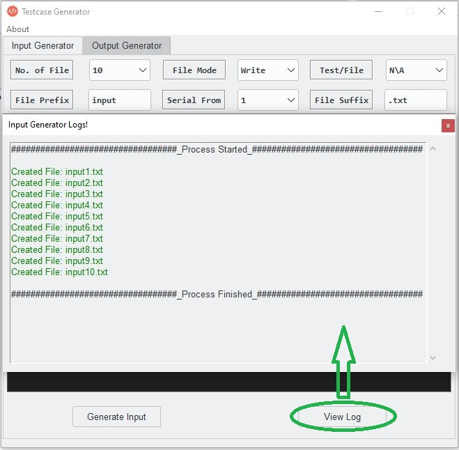
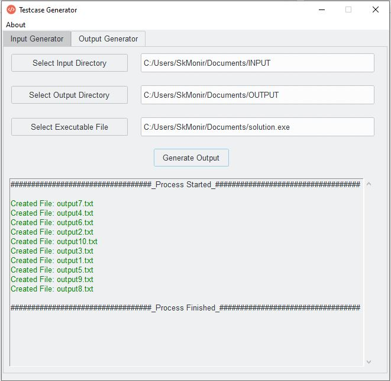
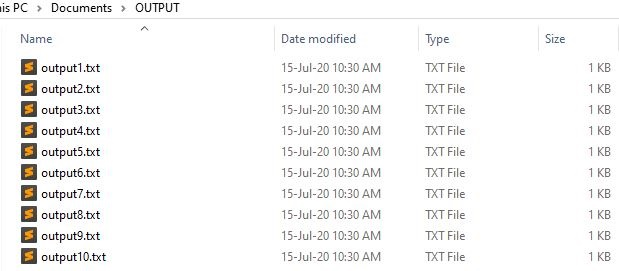

# Introduction
**Testcase Generator** is a handy tool for preparing the input and output dataset for programming problem. Input generator is implemented using [CodeForces](https://www.codeforces.com/) [testlib.h](https://codeforces.com/testlib) library in C++. This tool is specially helpful for the problem author and tester of a programming competition.

# Features
* ## Input Generator
    Most of the programming problems contain a large number of input dataset. Solver's source code runs against these input dataset and provides verdict accordingly. So it's important to prepare valid testcases. But it's not easy to generate a large number of handmade testcases. This is where Input Generator comes into the picture. It generates specified number of testcase files in just a few seconds.
* ## Output Generator
    For every programming problem there are some input dataset and corresponding output dataset. That means a solver's souce code will be considered correct if the source code runs against the input dataset and produces output exactly same as the judge output dataset. So judge output should be accurate. Output Generator runs the judge solution executable(.exe) against the input dataset and prepare output dataset accordingly in just a few seconds.

# Screenshots
Input Generator screen. The script in the CLI is for generating a tree of nodes 10 to 15.<br>



<br>
Successfully generated input folder. <br>



<br>
Input Generator logs. <br>



<br>
Output Generator screen. <br>



<br>
Successfully generated output folder. <br>



# Installation
**Testcase Generator** runs on WINDOWS. 

**Installation steps**:
* Download the installation setup file from [here]().
* Double click on the setup to start the installation.
* Select a directory where you want to install and click install.
* After installation is successful go to the installation directory.
* Find the file **testcaseGenerator.exe**. You can directly open the application by double clicking this file or you can create a shortcut on the Desktop for quick access.
* To create a shortcut on the Desktop:<br>
    `right click on testcaseGenerator.exe > Send to > Desktop(create shortcut)`
* Open the shortcut from Desktop and enjoy.

# Components
* ## Input Generator
    * ### `No. of File`
        The number of input files to generate. For example, if we select 10, then 10 input files will be generated.

    * ### `File Mode`
        There are two options for File Mode.<br>

        **Write**: If the file already exists then the contents in the file will be overwritten by the new contents. Otherwise, new file will be opened. <br>
        For example, if a file contains a line ```This is older line``` and we now want to write a new line ```This is new line```, then after Write operation the file will contain ```This is new line```. <br>

        **Append**: Applied when expected file already exists. In Append mode, new contents will be concatenated with the older contents in the file.<br>
        In the example in Write mode, if we do the same in Append mode, then the file will contain both lines after Append operation.

    * ### `Test/File`
        Defines the number of testcases for each input file. More formally, it is used for multitest input dataset. `N\A` means there is no multitest. Any other numeric value means the number of testcases for each input file.

        **Example**: Suppose we want to generate an array of 5 integers in range [1, 10].
        
        For `Test/File = N\A`, we will get a random array of size 5 like the following.<br>
        ```
        4 6 7 2 1
        ```

        For `Test/File = 2`, we will get random array of size 5 twice like the following.
        ```
        2
        4 6 7 2 1
        2 10 8 9 5
        ```
    
    * ### `File Prefix`
        The prefix of the filename. More formally, file name will be started with the File Prefix. For example, if we use `input` as File Prefix, then every file name will start with `input`.

    * ### `File Suffix`
        It is basically the extension of the input files. So the suffix can be `txt`, `in` etc. and the filename would be something like `input.txt`, `input.in` respectively.

    * ### `Serial From`
        Every input file will contain a serial number assigned to the file name. First file will get the serial number from `Serial From` field and every subsequent file's serial number will be incresed by 1.<br>
        For example, if we choose 1 in `Serial From`, files will be generated as following:
        ```
        input1.txt
        input2.txt
        input3.txt
        .
        .
        .
        ```

    * ### `Run Generator Script Exe`
        This is one of the generating methods. If we have the executable(.exe) of our own generator script, we can simply use the executable to generate input dataset. After selecting `Run Generator Script Exe` option, a file selector field will be appeared from where we can select out exe file.
    
    * ### `Write TGen Script in CLI`
        This is the simplest method to write script for generator. Introducing a new command line script named `TGen Script` for generating input dataset. A Command Line Interface(CLI) is integrated with the application. Also for the quick access of the available commands, there is a dropdown menu from where we can select expected command and insert it to our CLI.<br>

        ```
        Note: All available commands will be described in the section "Available TGen Commands"
        ```

    * ### `Input Directory`
        The directory where all the input files will be saved.

    * ### `Generate Input`
        Clicking **Generate Input** button will start the process of generating input dataset.

    * ### `View Log`
        Clicking **View Log** button will open an window with the logs of input generator. Successful operations will be logged in `green` color text and failed operations will be logged in `red` color text.
    
* ## Output Generator
    * ### `Input Directory`
        The directory from where the input files will be run.
        ```
        Note: Make sure that the directory doesn't contain anything other than the input dataset.
        ```

    * ### `Output Directory`
        The directory where all the output files will be saved.

    * ### `Executable File`
        The executable(.exe) of the solution.

# Available TGen Commands

# Bottlenecks
The application is implemented using [Python Tkinter](https://docs.python.org/3/library/tkinter.html) GUI framework for developing light desktop application. Tkinter is single threaded framework and it doesn't allow any other thread on the application. Basically, when any other thread is spawned the framework prevents interaction with the UI. Input Generator and Output Generator both uses multiple thread creation for faster performance. So be careful not to put heavy load on the application. Otherwise the application will be crashed and you will end up blamming me.